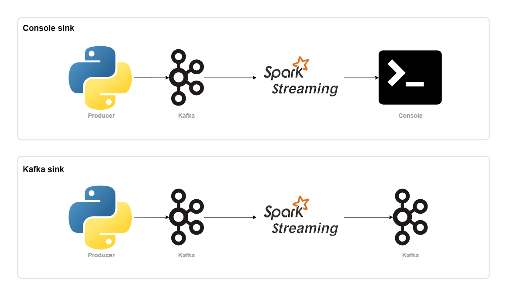

# Kafka + Structured Streaming

# Strutuctured Streaming

Strutuctured Streaming is a scalable and fault-tolerant stream processing engine built on the Spark SQL engine. The Spark SQL engine will take care of running it incrementally and continuously and updating the final result as streaming data continues to arrive. The streaming queries are processes using a micro-batch processing engine, which processes data streams as a series of small batch jobs thereby achieving end-to-end latencies as low as 100ms, now the Continuous Processing mode can achieve end-to-end latencies as low as 1ms.

## Window Operations on Event Time

Aggregations over a sliding event-time window are straightforward with Structured Streaming and are very similar to grouped aggregations. In window-based aggregations, aggregate values are maintained for each window the event-time of a row fall into.

```python
windowed_count = (
    df.groupBy(
        window("timestamp", "10 minutes", "5 minutes"),
        "key"
    ).count()
)
```

## Handling Late Data and Watermarking

It's used if one of the events arrives late to the application and is necessary updates counts from the older window. It's possible defines the threshold of how late is the data allowed to be. For grouped aggregation is need wich sink output mopde must be update or append.

```python

from pyspark.sql.functions import when

tumbling_windows = (
    df
    .withWatermark("timestamp", "10 minutes")
    .groupBy(
        window("timestamp", "10 minutes"),
        "key"
    ).count()
)

sliding_windows = (
    df
    .withWatermark("timestamp", "10 minutes")
    .groupBy(
        window("timestamp", "10 minutes", "5 minutes"),
        "key"
    ).count()
)

session_windows = (
    df
    .withWatermark("timestamp", "10 minutes")
    .groupBy(
        session_window("timestamp", "5 minutes"),
        "key"
    ).count()
)
```

## Output Modes

There are three types of output modes:

**Append mode (default):** where only the new rows added to the result table since the last trigger will be outputted to the sink. Used in queries with only select, where, map, flatMap, filter, join, etc.

**Complete mode:** the whole result table will be outputtes to the sink after every trigger. This is supportes for aggregation queries.

**Update mode:** only the rows in the result table that were updated since the last trigger will be outputted to the sink.

## Foreach and ForeachBatch


## Triggers

## Objective

## Technologies


## Architecture
   


## Debug

```bash
docker-compose up -d
```

```bash
docker exec -it spark-master bash
```
```bash
spark-submit --packages org.apache.spark:spark-sql-kafka-0-10_2.12:3.3.0 /app/consumer/consumer.py
```
