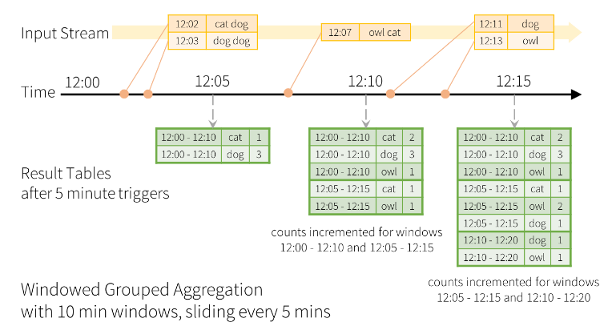
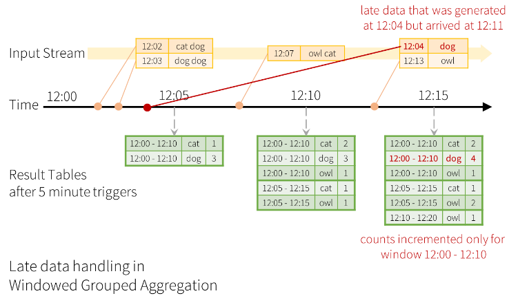

# Kafka + Structured Streaming


## Structured Streaming
Structured Streaming is a scalable and fault-tolerant stream processing engine built on the Spark SQL engine. The Spark SQL engine will take care of running it incrementally and continuously and updating the final result as streaming data continues to arrive. The streaming queries are processes using a micro-batch processing engine, which processes data streams as a series of small batch jobs thereby achieving end-to-end latencies as low as 100ms, now the Continuous Processing mode can achieve end-to-end latencies as low as 1ms.

### Window Operations on Event Time

Aggregations over a sliding event-time window are straightforward with Structured Streaming and are very similar to grouped aggregations. In window-based aggregations, aggregate values are maintained for each window the event-time of a row fall into.

<p align = "center">

</p>
<p align = "center">
Fig.1 - Windowed Group Aggregation with 10 min windows, sliding every 5 minutes. (Structured Streaming Documentation)
</p>

```python
windowed_count = (
    df.groupBy(
        window("timestamp", "10 minutes", "5 minutes"),
        "key"
    ).count()
)
```

### Handling Late Data and Watermarking

It's used if one of the events arrives late to the application and is necessary updates counts from the older window. It's possible defines the threshold of how late is the data allowed to be. For grouped aggregation is need wich sink output mopde must be update or append.

<p align = "center">

</p>
<p align = "center">
Fig.2 - Late data handling in Windowed Grouped Aggregation. (Structured Streaming Documentation)
</p>


```python
tumbling_windows = (
    df
    .withWatermark("timestamp", "10 minutes")
    .groupBy(
        window("timestamp", "10 minutes"),
        "key"
    ).count()
)

sliding_windows = (
    df
    .withWatermark("timestamp", "10 minutes")
    .groupBy(
        window("timestamp", "10 minutes", "5 minutes"),
        "key"
    ).count()
)

session_windows = (
    df
    .withWatermark("timestamp", "10 minutes")
    .groupBy(
        session_window("timestamp", "5 minutes"),
        "key"
    ).count()
)
```

### Output Modes

There are three types of output modes:

**Append mode (default):** where only the new rows added to the result table since the last trigger will be outputted to the sink. Used in queries with only select, where, map, flatMap, filter, join, etc.

**Complete mode:** the whole result table will be outputtes to the sink after every trigger. This is supportes for aggregation queries.

**Update mode:** only the rows in the result table that were updated since the last trigger will be outputted to the sink.

### Foreach and ForeachBatch

The Foreach and ForeachBatch operations allow you to apply arbitrary operations and writing logic on the output of a streaming query. The foreach allows custom write logic on every row and foreachBatch allows arbitrary operations and custom logic on the output of each micro-batch.

The ForeachBatch cans reuse existing batch data sources, write to multiple locations and apply additional DataFrame operations.

```python
def function(df, epoch_id)
    ...

(
    df
    .writeStream
    .foreachBatch(function)
    .start()
)
```

The Foreach cans express custom writer logic by dividing into three methods: open, process and close.

```python
class ForeachWriter:

    def open(self, partition_id, epoch_id):
        # This method is optional in Python
        ...
    
    def process(self, row):
        # This method is not optional in Python
        ...

    def close(self, error):
        # This method is optional in Python
        ...

(
    df
    .writeStream
    .foreach(ForeachWriter())
    .start()
)
```

### Triggers

The trigger settings of streaming define the timing of streaming data processing, wheter the query is going to be executed as micro-batch query with a fixed batch interval or as a continuous processing query.

**Unspecified (default):**: the query will be executedin micro-batch mode.

```python
(
    df
    .writeStream
    .format("console")
    .start()
)
```

**Fixed interval:** the query will be executed with micro-batches mode with specified intervals.

```python
(
    df
    .writeStream
    .format("console")
    .trigger(processingTime="2 seconds")
    .start()
)
```
**One-time:** the query will execute only one micro-batch to process all the availabledata and stop on its own.

```python
(
    df
    .writeStream
    .format("console")
    .trigger(once=True)
    .start()
)
```

**Available now:**: the query will process all the available data and then stop on its own.

```python
(
    df
    .writeStream
    .format("console")
    .trigger(availableNow=True)
    .start()
)
```

**Continuous:** the query will be executed in the new low-latency.

```python
(
    df
    .writeStream
    .format("console")
    .trigger(continuous="1 second")
    .start()
)
```

## Objective

## Technologies


## Architecture

<p align = "center">

</p>
<p align = "center">
Fig.3 - Spark Streaming Architecture with Python Producer and Kafka.
</p>

## Debug

```bash
docker-compose up -d
```

```bash
docker exec -it spark-master bash
```
```bash
spark-submit --packages org.apache.spark:spark-sql-kafka-0-10_2.12:3.3.0 /app/consumer/consumer.py
```
